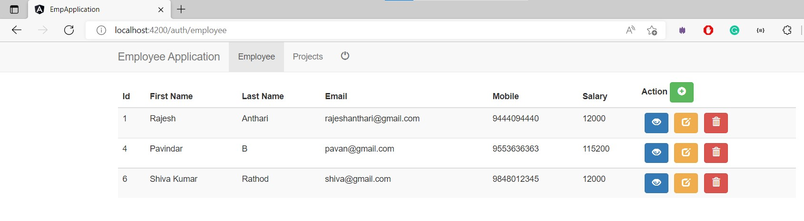

# Employee CRUD Application
- Clone the repository
- Use _java -jar dist-files/angular-crud-0.0.1-SNAPSHOT.jar_
- Application will start with 9553 port
## Postman Collection
- Import [_angular-crud/src/main/resources/postman/Employee Collection.postman_collection.json_](https://github.com/antharir/employee-crud-application/blob/main/angular-crud/src/main/resources/postman/Employee%20Collection.postman_collection.json) to perform basic CRUD operation
## Application UI
> Login Page

> Employee List

> Employee Add/Edit

